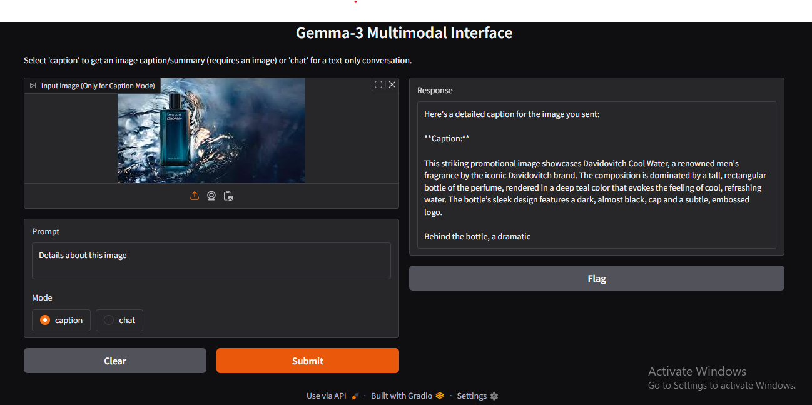

# Gemma3-Multimodal-Interface

A simple Gradio interface for interacting with Google's Gemma-3 multimodal model through Hugging Face.

## Overview

This application provides a user-friendly web interface to interact with Google's Gemma-3 multimodal model (gemma-3-4b-it). It supports two modes of operation:
- **Caption Mode**: Upload an image and provide a prompt to get detailed image captions or visual analysis
- **Chat Mode**: Have a text-only conversation with the model



## About Gemma-3

Gemma-3 is Google's latest open multimodal model family that combines powerful visual understanding and text generation capabilities:

- **Truly Multimodal**: Unlike text-only models, Gemma-3-4b-it can process both images and text, enabling visual understanding and reasoning
- **Efficient Architecture**: With only 4 billion parameters, it strikes an excellent balance between performance and resource requirements
- **Single GPU Friendly**: Can run efficiently on a single consumer GPU (8GB+ VRAM recommended)
- **Strong Visual Capabilities**: Can analyze complex images, identify objects, read text from images, and describe visual scenes
- **Competitive Performance**: Despite its relatively small size, it delivers performance comparable to much larger multimodal models
- **Flexible Deployment**: Designed for efficient inference across different hardware configurations

## Features

- Interactive web interface built with Gradio
- Support for image captioning and detailed visual analysis
- Text-only chat capabilities
- Optimized for efficient inference on CUDA-enabled devices
- Works on consumer GPUs (RTX 3060 and above recommended)
- Minimal setup requirements compared to larger vision-language models

## Prerequisites

- Python 3.x
- PyTorch with CUDA support (recommended)
- Single NVIDIA GPU with 8GB+ VRAM
- Hugging Face account with access to the Gemma-3 model
- Hugging Face API token

## Installation

1. Clone this repository:
```bash
git clone https://github.com/manojrathor08/Gemma3-Multimodal-Interface.git
cd Gemma3-Multimodal-Interface
```

2. Install dependencies:
```bash
pip install -r requirements.txt
```

3. Set your Hugging Face token as an environment variable:
```bash
export HF_TOKEN="your_hugging_face_token"
```

## Usage

Run the application:
```bash
python app.py
```

This will launch a Gradio interface accessible at `http://localhost:7860` and also generate a temporary public URL.

### Using the Interface

1. **Caption Mode**:
   - Upload an image
   - Enter a prompt (e.g., "Describe this image in detail", "What objects do you see?", "Read the text in this image")
   - Select "caption" mode
   - Click "Submit"

2. **Chat Mode**:
   - Enter your text prompt
   - Select "chat" mode
   - Click "Submit"

## Performance & Hardware Recommendations

- **Minimum**: NVIDIA GPU with 8GB VRAM (e.g., RTX 3060)
- **Recommended**: NVIDIA GPU with 12GB+ VRAM (e.g., RTX 3080, 4070)
- **CPU Operation**: Possible but significantly slower
- **Inference Speed**: ~1-3 seconds per response on recommended hardware
- **Memory Usage**: ~5-6GB VRAM during inference

## Technical Details

The application:
- Uses the `google/gemma-3-4b-it` model from Hugging Face
- Implements memory-efficient inference with PyTorch
- Disables certain CUDA optimizations for better compatibility
- Limits generation to 100 tokens per response
- Runs the model in evaluation mode for consistent outputs
- Uses bfloat16 precision for improved performance

## Model Capabilities

- **Image Understanding**: Identifies objects, scenes, activities, and visual details
- **OCR Functionality**: Can extract and interpret text from images
- **Visual Reasoning**: Understands spatial relationships between objects
- **Detailed Descriptions**: Generates comprehensive captions with relevant details
- **Contextual Awareness**: Responds to specific questions about visual content

## Requirements

```
gradio>=4.0.0
transformers>=4.34.0
torch>=2.0.0
pillow>=9.0.0
```

## License

MIT License


## Acknowledgments

- Google for the Gemma-3 model
- Hugging Face for model hosting and transformers library
- Gradio for the web interface framework
